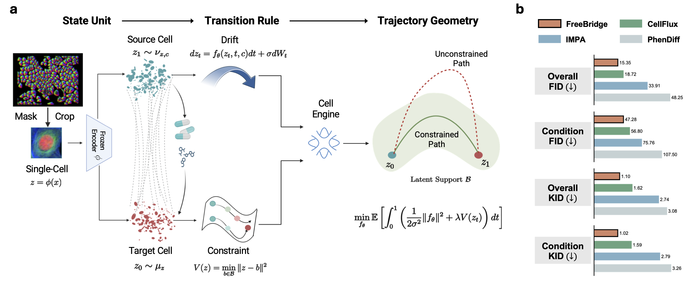
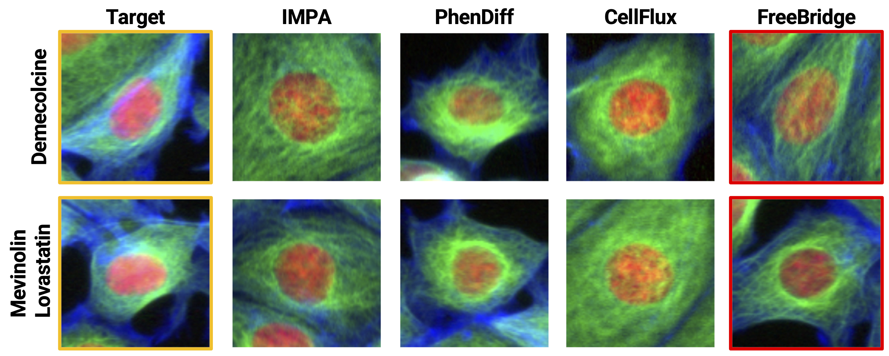
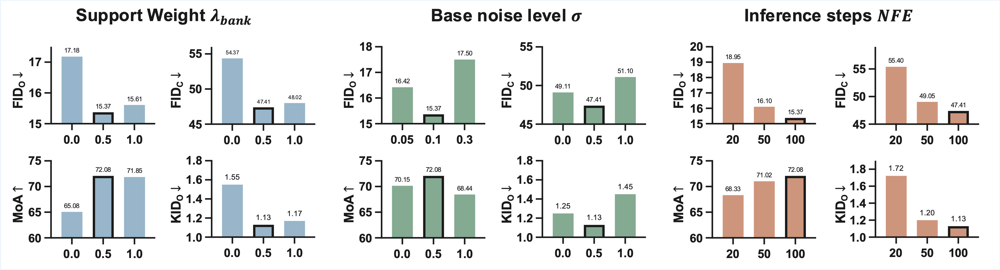

<div align="center">

  

  <h2>FreeBridge: Variational Schrödinger Bridges for Cellular Transition Dynamics</h2>

  <p><b>MICCAI 2026</b></p>

  <br>

  <p>
    <a href="https://github.com/curioWang">Xurui Wang</a><sup>1,2 ★</sup>&nbsp;&nbsp;
    <a href="https://soonera.github.io/qinren">Qin Ren</a><sup>1 ★</sup>&nbsp;&nbsp;
    <a href="https://ca.linkedin.com/in/jun-ma-867b34224">Jun Ma</a><sup>3</sup>&nbsp;&nbsp;
    <a href="https://scholar.google.com/citations?user=v3w4IYUAAAAJ">Haibin Ling</a><sup>1</sup>&nbsp;&nbsp;
    <a href="https://chenyuyou.me/">Chenyu You</a><sup>1 ✉</sup>
  </p>

  <p>
    <sup>1</sup> Stony Brook University &nbsp;&nbsp;
    <sup>2</sup> University of Toronto &nbsp;&nbsp;
    <sup>3</sup> University Health Network <br>
    <sup>★</sup> Equal Contribution &nbsp;&nbsp;
    <sup>✉</sup> Corresponding Author
  </p>

  <p>
    <a href="https://arxiv.org/abs/2606.11286">
      
    </a>
    <a href="https://y-research-sbu.github.io/FreeBridge/">
      
    </a>
    <a href="https://github.com/Y-Research-SBU/FreeBridge">
      
    </a>
    <a href="https://huggingface.co/datasets/Y-Research-Group/BBBC021">
      
    </a>
  </p>

</div>

## Abstract

> We introduce **FreeBridge**, a Schrödinger Bridge formulation for modeling single-cell perturbation responses from **endpoint-only** data: control and perturbed populations, with no observed per-cell trajectories.
>
> FreeBridge is built as a **Cell Engine** that separates *state specification* (the space of valid single-cell states) from *stochastic transport* (the dynamics between them):
>
> - **State Unit:** instance-segmented single-cell crops define a fixed, empirically supported latent manifold.
> - **Transition Rule:** a Schrödinger Bridge drift transports control cells to perturbed cells within that manifold.
> - **Support Cost:** a geometric penalty keeps intermediate states on the observed-morphology manifold.
>
> On BBBC021, RxRx1, and JUMP, FreeBridge matches or improves endpoint fidelity under a unified protocol, while keeping intermediate trajectories closer to the data manifold.

<p align="center">
  
</p>
<p align="center"><sub><em>Figure 1. (a) The Cell Engine: single-cell states define the manifold, and a Schrödinger Bridge drift transports control (source, t=0) to perturbed (target, t=1) cells under an empirical support cost. (b) On BBBC021, FreeBridge achieves lower overall and condition-level FID and KID than PhenDiff, IMPA, and CellFlux.</em></sub></p>

## Main Results

Endpoint-fidelity results from the FreeBridge paper (MICCAI 2026) on BBBC021, under the unified single-cell protocol (5k generated samples per condition, averaged over three seeds).

| Method | FID (overall) ↓ | FID (condition) ↓ | KID (overall) ↓ | KID (condition) ↓ | R<sub>viol</sub> ↓ |
|---|---|---|---|---|---|
| PhenDiff | 48.25 | 107.50 | 3.08 | 3.26 | 0.38 |
| IMPA | 33.91 | 75.76 | 2.74 | 2.79 | 0.34 |
| CellFlux | 18.72 | 56.80 | 1.62 | 1.59 | 0.31 |
| **FreeBridge** | **15.35** | **47.28** | **1.10** | **1.02** | **0.11** |

R<sub>viol</sub> is the Support Violation Rate: the fraction of intermediate states whose features fall outside the empirical morphology support — a support-feasibility measure, not verified temporal ordering.

## Qualitative Results

<p align="center">
  
</p>
<p align="center"><sub><em>Figure 2. Qualitative comparison of endpoint morphology on BBBC021 for two perturbations (Demecolcine; Mevinolin/Lovastatin). Target (left) versus IMPA, PhenDiff, CellFlux, and FreeBridge (right). FreeBridge preserves compound-specific structure such as nuclear compaction and cytoplasmic shrinkage.</em></sub></p>

## Hyperparameter Sensitivity

We vary the support weight λ<sub>bank</sub>, base noise level σ, and number of inference steps (NFE); endpoint fidelity stays stable across all settings. The support weight matters most: setting it to 0 removes the support cost and recovers the CellFlux baseline, while 0.5 is best in the sweep below.

<p align="center">
  
</p>
<p align="center"><sub><em>Figure 3. Hyperparameter sensitivity on BBBC021 over support weight λ<sub>bank</sub>, base noise level σ, and inference steps (NFE). Endpoint fidelity stays stable across settings, with moderate λ<sub>bank</sub> improving MoA retention.</em></sub></p>

Support-weight sweep (BBBC021); MoA is mechanism-of-action classification accuracy (%):

| λ<sub>bank</sub> | FID (overall) ↓ | FID (condition) ↓ | MoA (%) ↑ | KID (overall) ↓ |
|---|---|---|---|---|
| 0.0 (≡ CellFlux) | 18.72 | 56.80 | — | 1.62 |
| **0.5** | **15.37** | **47.41** | **72.08** | **1.13** |
| 1.0 | 15.61 | 48.02 | 71.85 | 1.17 |

The support-weight 0.5 (full-model) row is from an independent ablation run and differs marginally from the main table (15.37 vs 15.35 overall FID), as noted in the paper.

## Installation

> **Important:** this code uses PyTorch-Lightning **1.x** hooks (`training_epoch_end` / `validation_epoch_end`). Install `pytorch-lightning==1.8.5.post0` as pinned in `environment.yml`; **Lightning 2.x is not supported.**

```bash
conda env create -f environment.yml
conda activate freebridge
pip install -e .
```

## Data Preparation

The single-cell pipeline (`data_prep/`) turns raw BBBC021 fields into the latent endpoints used for transport:

1. **Crop single cells** from precomputed Cellpose/instance masks (96×96): `crop_bbbc021_singlecell.py` (takes `--mask_root`), orchestrated per imaging week by `run_week.sh`.
2. **Train the VAE encoder** (and optionally fine-tune its decoder): `train_vae_full.py`, `finetune_decoder_lpips.py`.
3. **Build train/val/test splits** of crop paths: `make_split.py`.
4. **Encode crops to latents** (deterministic `mu` by default) with the trained VAE: `export_latents_from_vae.py`, which saves a `.pt` of `{Z, paths}`.
5. **Group latents into control/perturbed endpoints**: `build_bbbc021_endpoints.py`, which writes the four endpoint files referenced in the config:

```
data/bbbc021/
├── src_train.npy
├── tgt_train.npy
├── src_val.npy
└── tgt_val.npy
```

The control/target assignment is supplied via `--control_regex` and `--target_regex`. BBBC021 crop filenames encode plate, well, and site (e.g. `Week1_150607_B02_s1_c124_cell0001.png`) and do not contain compound or MoA names. First map well to compound using the BBBC021 metadata, or organize crops into condition-named folders so the regexes have something to match:

```
crops/
├── DMSO/      # control
└── taxol/     # target
```

```bash
python data_prep/build_bbbc021_endpoints.py \
    --train_pt exports/train_latents.pt --val_pt exports/val_latents.pt \
    --control_regex "DMSO" --target_regex "taxol" \
    --out_dir data/bbbc021
```

> **Note:** `run_week.sh` expects a `raw_list.txt` (the list of BBBC021 raw image zips) next to it in `data_prep/`. Provide your own list, or download BBBC021 from the [Broad Bioimage Benchmark Collection](https://bbbc.broadinstitute.org/BBBC021).

## Training

> **Note on the first epoch.** Lightning sanity validation is disabled, so epoch 0 trains on a straight-line warm start; the fitted Gaussian paths (R-step) are used from epoch 1 onward. **Use `optim.max_epochs >= 2`** (a single-epoch run only sees the warm start).

```bash
# FreeBridge (default, lambda_bank = 0.5)
python train.py experiment=bbbc021

# enable the latent-space FID diagnostic during training
python train.py experiment=bbbc021 eval_coupling=true

# support-weight sweep (lambda_bank)
python train.py experiment=bbbc021 state_cost.support_weight=0.0
python train.py experiment=bbbc021 state_cost.support_weight=0.5
python train.py experiment=bbbc021 state_cost.support_weight=1.0
```

## Citation

If you find FreeBridge useful in your research, please cite:

```bibtex
@article{wang2026freebridge,
  title={FreeBridge: Variational Schr{\"o}dinger Bridges for Cellular Transition Dynamics},
  author={Wang, Xurui and Ren, Qin and Ma, Jun and Ling, Haibin and You, Chenyu},
  journal={arXiv preprint arXiv:2606.11286},
  year={2026}
}
```

> Accepted at MICCAI 2026. The citation will be updated to the official proceedings entry once published.

## Acknowledgements

This codebase is built upon [Generalized Schrödinger Bridge Matching (GSBM)](https://github.com/facebookresearch/generalized-schrodinger-bridge-matching) (Liu et al., ICLR 2024). The single-cell perturbation task and unified evaluation protocol follow [CellFlux](https://github.com/yuhui-zh15/CellFlux) (Zhang et al., 2025). We thank the authors for releasing their code.

## License

This project is released under the license in [`LICENSE.md`](./LICENSE.md) (CC BY-NC 4.0). Portions of this code are derived from GSBM and remain subject to the original license terms.
