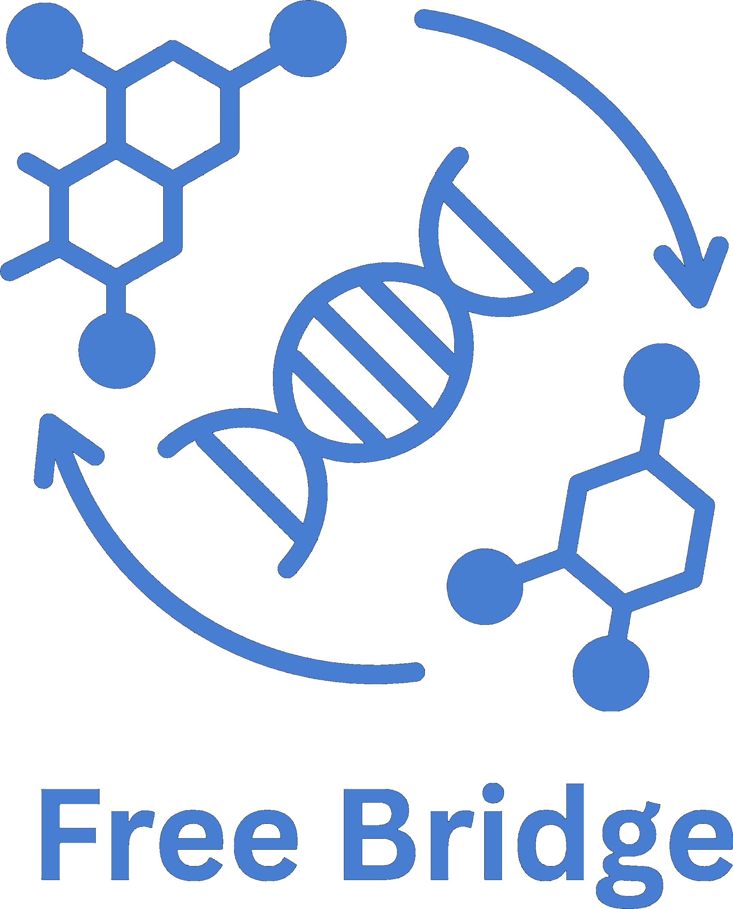

<div align="center">



<h1>FreeBridge</h1>

<h3>
Empirical-Support Bridge Matching for Single-Cell Latent Transition Modeling
</h3>

<p>
  <a href="https://github.com/curioWang">Xurui Wang</a><sup>1,2</sup>&nbsp;
  <a href="https://soonera.github.io/qinren">Qin Ren</a><sup>1</sup>&nbsp;
  <a href="https://ca.linkedin.com/in/jun-ma-867b34224">Jun Ma</a><sup>3</sup>&nbsp;
  <a href="https://scholar.google.com/citations?user=v3w4IYUAAAAJ">Haibin Ling</a><sup>1</sup>&nbsp;
  <a href="https://chenyuyou.me/">Chenyu You</a><sup>1</sup>
</p>

<p>
  <sup>1</sup> Stony Brook University &nbsp;&nbsp;
  <sup>2</sup> University of Toronto &nbsp;&nbsp;
  <sup>3</sup> University Health Network
</p>

<p align="center">
  <a href="#">
    
  </a>
  <a href="https://github.com/Y-Research-SBU/FreeBridge">
    
  </a>
  <a href="https://huggingface.co/datasets/CurioWang/BBBC021">
    
  </a>
  <a href="#">
    
  </a>
</p>

</div>

---

## Overview

FreeBridge studies stochastic transition modeling between cellular states using fixed single-cell latent representations.

The released code focuses on a BBBC021 latent-transport pipeline:

- instance-level cell representations are extracted from microscopy images;
- control and perturbed cells are represented as endpoint latent distributions;
- a time-dependent bridge model is trained between the endpoint distributions;
- an empirical-support state cost discourages intermediate samples from leaving the observed cellular latent manifold.

This repository is intended as research code for reproducing and extending the latent bridge experiments. The public release is intentionally compact: core training code, configuration files, BBBC021 preprocessing utilities, and a sampling script.

<!--
Add the paper framework figure here after copying it into the repository.

<p align="center">
  
</p>
-->

## Method

FreeBridge separates single-cell state construction from latent transition modeling.

```text
single-cell crops
      ↓
frozen image encoder / latent representation
      ↓
control and perturbed endpoint distributions
      ↓
bridge matching with empirical-support regularization
      ↓
sampled latent transitions and generated target latents
```

The empirical-support cost is implemented as a nearest-neighbor penalty in latent space:

```text
V_t(z) = λ · d_emp(z)^2
```

where `d_emp(z)` is the distance from an intermediate latent state to the empirical support bank formed from observed endpoint latents.

<!--
Add the method figure here after copying it into the repository.

<p align="center">
  
</p>
-->

## Results

Please add the final paper tables or exported result screenshots once the camera-ready numbers are fixed.

Recommended layout:

### Endpoint Alignment

| Dataset | Method | Metric 1 | Metric 2 | Metric 3 |
|---|---:|---:|---:|---:|
| BBBC021 | Baseline | -- | -- | -- |
| BBBC021 | FreeBridge | -- | -- | -- |

### Support Preservation

| Dataset | Method | Support Violation ↓ | MoA Retention ↑ |
|---|---:|---:|---:|
| BBBC021 | Baseline | -- | -- |
| BBBC021 | FreeBridge | -- | -- |

<!--
If you prefer figure-based presentation, export your paper tables as images and use:

<p align="center">
  
</p>

<p align="center">
  
</p>
-->

## Visualization

Add latent-space visualizations after finalizing the figures.

<!--
Example:

<p align="center">
  
</p>
-->

## Installation

```bash
git clone https://github.com/Y-Research-SBU/FreeBridge.git
cd FreeBridge

conda env create -f environment.yml
conda activate freebridge
```

## Data Preparation

The BBBC021 pipeline expects latent endpoint files in:

```text
data/bbbc021/
├── src_train.npy
├── tgt_train.npy
├── src_val.npy
└── tgt_val.npy
```

Preprocessing utilities are provided in `data_prep/`.

## Training

```bash
python train.py experiment=bbbc021
```

Support-weight ablations can be launched with:

```bash
bash scripts/train.sh
```

## Sampling

```bash
python sample_bbbc021_latents.py \
  --ckpt outputs/runs/bbbc021/<date>/<time>/checkpoints/last.ckpt \
  --out_npy outputs/generated_latents.npy \
  --n 1024
```

## Repository Structure

```text
FreeBridge/
├── freebridge/                  # model, SDE, loss, state-cost, and training modules
├── configs/                     # Hydra training configs
├── data_prep/                   # BBBC021 preprocessing and latent export utilities
├── scripts/                     # convenience launch scripts
├── assets/                      # logo and paper figures
├── train.py                     # main training entry point
└── sample_bbbc021_latents.py    # latent sampling from a trained checkpoint
```

## Citation

If you find this repository useful, please cite the paper once the public preprint is available.

```bibtex
@article{wang2026freebridge,
  title   = {FreeBridge: Empirical-Support Bridge Matching for Single-Cell Latent Transition Modeling},
  author  = {Wang, Xurui and Ren, Qin and Ma, Jun and Ling, Haibin and You, Chenyu},
  journal = {arXiv preprint},
  year    = {2026}
}
```

## Acknowledgements

FreeBridge builds on ideas and software components from the open-source scientific machine learning community, including prior work on bridge matching, stochastic differential equation solvers, PyTorch Lightning, Hydra, and single-cell image analysis tools.

We thank the authors of these projects for making their work publicly available.
